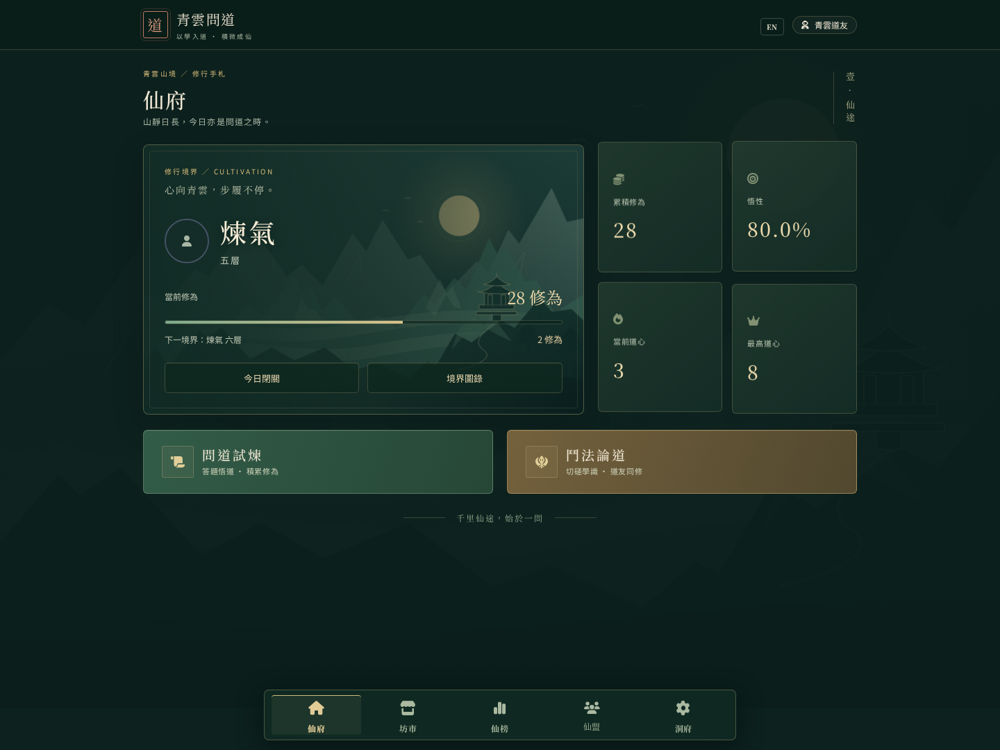
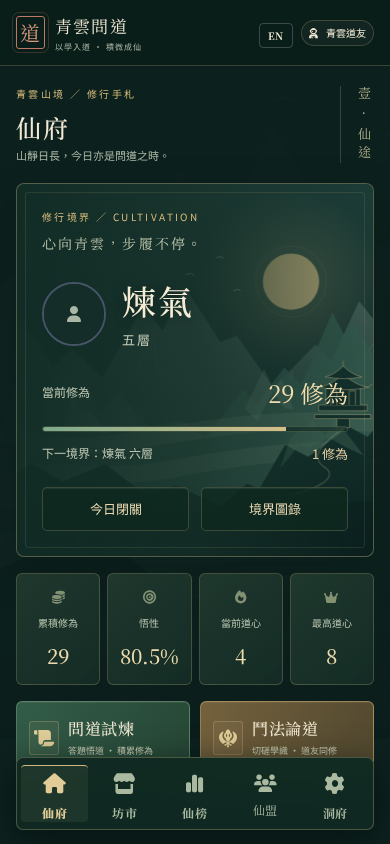
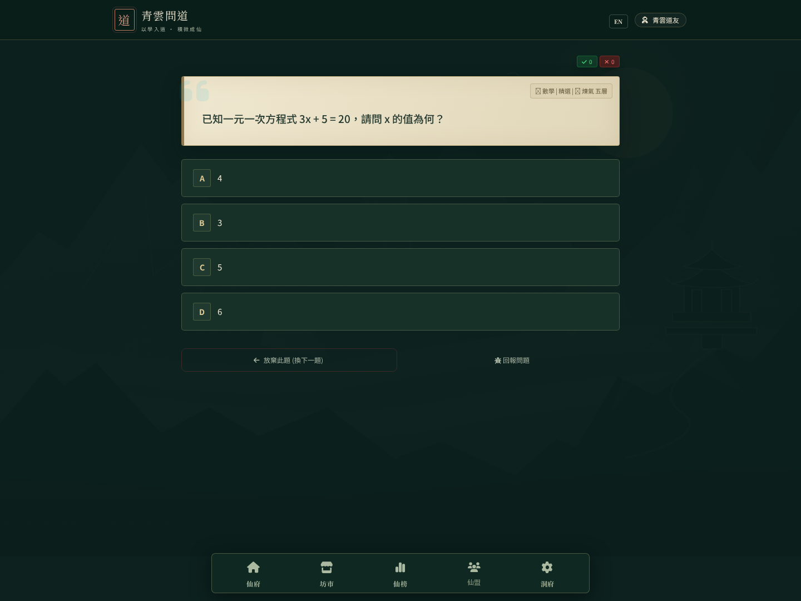

# 青雲問道：修仙視覺改版

主題採深青玉、古金、宣紙與山水殿閣，讓登入、仙府、答題、仙榜、坊市、洞府及共用元件具有一致的修仙風格。標題使用 Noto Serif TC，題目與操作說明保留 Noto Sans TC。

主要視覺樣式集中於 public/xianxia.css；山景為原創 SVG，無新增圖片服務或前端套件依賴。舊動態主題 CSS 已移至這份樣式表，避免載入順序互相覆蓋。

- 仙府保留既有修為、境界、道心、正確率與頭像資料。
- 問道與鬥法按鈕納入內容排版，手機可捲動瀏覽。
- 題目使用宣紙底色；正解與錯解保留文字、圖示和不同色彩。
- 舊卡牌頁面已被核心移除，因此一併移除其失效導覽入口。
- 支援鍵盤焦點、減少動態效果、裝置安全區及頁面縮放。

## 預覽

以下為實際頁面在模擬帳號、題庫與 Firebase 回應下的截圖，並非正式玩家資料。

## 驗證

- npm test：4 項修為回歸測試通過；境界文字預期已改為不含 emoji。
- JavaScript 語法檢查及 git diff --check 通過。
- Chromium：1440px 桌面、390px 手機、320px 窄螢幕；首頁與答題無水平溢出。
- 操作實際問道按鈕、選項、仙榜及洞府導覽；答對後仙府修為由 28 即時增加至 29。
- 圖表及 MathJax 在隔離預覽中使用替身；本次未驗證正式登入、多人對戰、數學排版服務或實際資料庫寫入。

尚未合併或部署。
